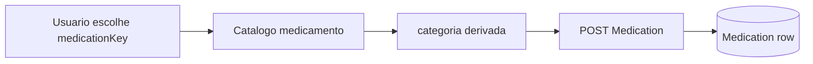

# Plano: dados clínicos estruturados (revisão com comorbidades e medicamentos)

## Objetivos

1. **Etapa 2 (Dados clínicos)**: tabagismo, álcool, exposição ocupacional e **alergias** como dados estruturados (JSON no `Patient`), com **alergias** apenas por seleção de substância no catálogo (**categoria automática**). Remover alergias da etapa 1 no assistente.
2. **Comorbidades**: corrigir UX em que **valores pré-selecionados** (ex.: tipo `OTHER`, gravidade `MODERATE` ao adicionar linha) e o comportamento do **dropdown pesquisável** dificultam buscar/selecionar o tipo desejado.
3. **Medicamentos em uso**: **categoria clínica automática** a partir da escolha do medicamento (catálogo), alinhado ao pedido de alergias — o usuário escolhe o fármaco (ou “Outro”), não a categoria.

## Situação atual (referência)

- [`Patient`](backend/prisma/schema.prisma): strings legadas para tabagismo/álcool/exposição; `allergies` texto; comorbidades/medicamentos em tabelas relacionadas com `ComorbidityType` e `MedicationCategory`.
- [`comorbidities-form.tsx`](frontend/src/components/patients/comorbidities-form.tsx): nova linha com `type: 'OTHER'`, `severity: 'MODERATE'` — isso **preenche** o `SearchableSelect` e pode **poluir** a busca (filtro inicial vs rótulo exibido).
- [`current-medications-form.tsx`](frontend/src/components/patients/current-medications-form.tsx): usuário preenche nome livre e escolhe **categoria** manualmente.
- [`searchable-select.tsx`](frontend/src/components/ui/searchable-select.tsx): ao abrir, o campo de busca pode não resetar de forma alinhada ao valor selecionado, agravando a sensação de “dados pré-selecionados atrapalham”.

---

## Parte A — Fatores de risco + alergias (cadastro Patient)

Como no plano anterior: novos campos JSON `smokingProfile`, `alcoholProfile`, `occupationalExposureEntries`, `allergyEntries`; catálogo de alergias com `substanceKey` → `label` + `category`; backend valida keys; sugestão de prontuário lê JSON + fallback de strings legadas.

Arquivos principais: [`schema.prisma`](backend/prisma/schema.prisma), [`create-patient.dto.ts`](backend/src/patients/dto/create-patient.dto.ts), [`patients.service.ts`](backend/src/patients/patients.service.ts), [`clinical-note-section-suggestion.service.ts`](backend/src/clinical-notes/clinical-note-section-suggestion.service.ts), [`patient-create-dialog.tsx`](frontend/src/components/patients/patient-create-dialog.tsx), [`patient-edit-page.tsx`](frontend/src/components/patients/patient-edit-page.tsx), [`validations/patient.ts`](frontend/src/lib/validations/patient.ts).

---

## Parte B — Comorbidades (UX + opcional catálogo)

**Problema:** linha nova já nasce com tipo/gravidade definidos; o select mostra rótulo fixo e a busca pode competir com o estado interno do componente.

**Ajustes propostos:**

1. **Nova linha “em branco” para escolha**
   - Não inicializar com `OTHER` + `MODERATE`. Usar estado de formulário com `type` e/ou `severity` **indefinidos** até o usuário escolher (no submit, validar e preencher defaults se necessário, ou rejeitar com mensagem clara).
   - Se o backend exigir enum não-nulo, usar valor sentinela só no payload final ou tornar opcionais no DTO de formulário e mapear antes do POST.

2. **`SearchableSelect`**
   - Ao **abrir** o popover: zerar `inputValue` (ou sincronizar só com query vazia) para a lista mostrar todas as opções e a busca começar limpa — evita filtro implícito baseado no rótulo “Outra”/“Moderada”.
   - Opcional: `value` vazio string `''` com placeholder “Selecione…” sem corresponder a opção até o usuário escolher.

3. **Fluxo opcional (melhor alinhamento a “só escolher”)**
   - Mesmo padrão de alergias: **lista canônica** de comorbidades (`comorbidityKey`) → preenche `ComorbidityType` + `name` automaticamente; “Outro” pede texto e força `OTHER`.

Arquivos: [`comorbidities-form.tsx`](frontend/src/components/patients/comorbidities-form.tsx), [`searchable-select.tsx`](frontend/src/components/ui/searchable-select.tsx), endpoints existentes de comorbidade no backend se houver validação extra.

---

## Parte C — Medicamentos (categoria automática)

**Objetivo:** usuário seleciona **medicamento** (catálogo); **categoria** (`MedicationCategory`) é **derivada** no cliente para exibição (badge) e **confirmada/revalidada** no servidor ao salvar.

**Implementação:**

1. **Catálogo** (ex.: `medicationKey` → `label` + `category`), compartilhado ou espelhado front/back como nas alergias.
2. **UI:** substituir o `SearchableSelect` de categoria por **leitura** (Badge) + combobox só de medicamento; fluxo “Outro” com nome livre e categoria `OTHER` ou heurística mínima.
3. **Backend:** ao receber `POST /patients/:id/medications`, aceitar `medicationKey` opcional; se presente, resolver `category` e `name` pelo catálogo; ignorar categoria enviada pelo cliente se política for “servidor é fonte da verdade”.

Arquivos: [`current-medications-form.tsx`](frontend/src/components/patients/current-medications-form.tsx), controller/service de medicação no backend, [`schema.prisma`](backend/prisma/schema.prisma) se precisar armazenar `catalogKey` opcional em `Medication`.

---

## Diagrama — medicamento com catálogo

---

## Ordem sugerida de implementação

1. Corrigir **`SearchableSelect`** + **comorbidades** (baixo risco, melhora imediata).
2. Catálogo + **medicamentos** (categoria automática).
3. Migração **Patient** fatores de risco + **alergias** estruturadas na etapa 2.
4. Testes e ajuste da sugestão de prontuário.

---

## Riscos

- **Compatibilidade:** registros antigos de medicamentos/comorbidades sem key — manter edição por nome/categoria legada até migrados.
- **Tamanho de catálogos:** manter listas em módulos versionados; evitar duplicar lógica divergente entre front e back (export único ou geração leve).
