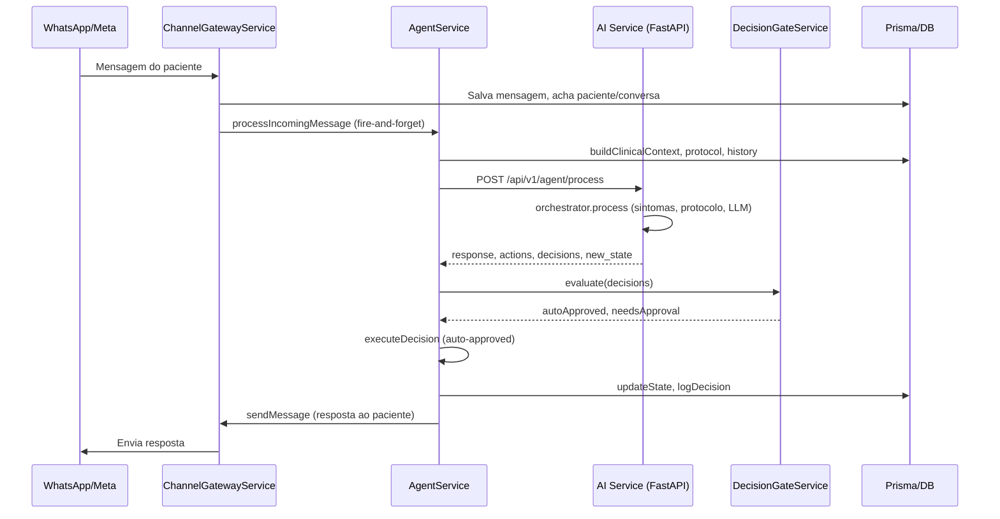

# Como funcionam os agentes do OncoNav

O projeto tem **dois “agentes” principais**: (1) o **pipeline de mensagens** (backend NestJS + AI Service Python), que processa cada mensagem do paciente e gera resposta + ações; e (2) o **agente agendado** (scheduler no backend), que dispara check-ins, questionários e lembretes em horários definidos.

---

## 1. Visão geral do fluxo (mensagem → resposta)

- **Entrada**: mensagem de texto do paciente via WhatsApp (ou canal configurado).
- **Saída**: resposta enviada ao paciente + ações executadas (alertas, sintomas, questionários, check-ins) e, quando aplicável, decisões que ficam pendentes de aprovação humana.

---

## 2. Onde tudo começa: Channel Gateway

- **Arquivo**: [backend/src/channel-gateway/channel-gateway.service.ts](backend/src/channel-gateway/channel-gateway.service.ts)
- Quando chega uma mensagem (ex.: WhatsApp), o `ChannelGatewayService.processIncomingMessage`:
  - Identifica o paciente pelo telefone e o tenant.
  - Cria/atualiza a conversa e persiste a mensagem.
  - Se a conversa estiver como **handledBy = NURSING**, o agente **não** é acionado.
  - Para mensagens **TEXT**, chama o agente em **fire-and-forget** (`setImmediate` + `agentService.processIncomingMessage`), para não atrasar a resposta 200 OK para a Meta (limite ~5s), já que o pipeline de IA pode levar até ~30s.

Ou seja: o “agente de conversa” é acionado apenas para mensagens de texto, e só quando a conversa não está sob responsabilidade da enfermagem.

---

## 3. Backend: AgentService (orquestração no NestJS)

- **Arquivo**: [backend/src/agent/agent.service.ts](backend/src/agent/agent.service.ts)
- **Método principal**: `processIncomingMessage(patientId, tenantId, conversationId, messageContent)`.

Passos resumidos:

1. **Conversa**: Busca a conversa; se `handledBy === 'NURSING'`, retorna e não processa.
2. **Contexto clínico**: `buildClinicalContext(patientId, tenantId)` — paciente, diagnósticos, tratamentos, passos de navegação, alertas, questionários, observações (tudo via Prisma).
3. **Protocolo**: `getActiveProtocol(tenantId, cancerType)` — protocolo ativo para o tipo de câncer (ex.: colorretal, bexiga).
4. **Histórico**: `getRecentHistory(conversationId, 20)` — últimas 20 mensagens da conversa.
5. **Config do agente**: `getAgentConfig(tenantId)` — provedor LLM, modelo, idioma, etc.
6. **Chamada ao AI Service**: `callAIService(...)` — `POST` para `AI_SERVICE_URL/api/v1/agent/process` (timeout 30s). Envia mensagem, contexto clínico, protocolo, histórico, `agentState` e `agent_config`.
7. **Resposta inválida ou indisponível**: Se o AI Service falhar ou devolver estrutura inválida, envia mensagem de fallback ao paciente e retorna.
8. **Decision gate**: `decisionGate.evaluate(aiResponse.decisions)` — separa decisões em **auto-aprovadas** e **exigem aprovação**.
9. **Execução**: Para cada decisão auto-aprovada, `executeDecision` — pode criar alerta, registrar sintoma, agendar check-in, salvar questionário, etc.
10. **Auditoria**: Todas as decisões (auto e pendentes) são registradas via `decisionGate.logDecision` (tabela `AgentDecisionLog`).
11. **Estado**: `conversationService.updateState(conversationId, aiResponse.newState)` — atualiza `agentState` da conversa (ex.: questionário ativo, contagem de mensagens).
12. **Resposta ao paciente**: `channelGateway.sendMessage(...)` com `aiResponse.response`.

Ou seja: o “agente” no backend é esse pipeline que monta contexto, chama a IA, aplica regras de aprovação e executa ações permitidas.

---

## 4. AI Service (Python): Orchestrator

- **Arquivo**: [ai-service/src/agent/orchestrator.py](ai-service/src/agent/orchestrator.py)
- **Rota**: `POST /api/v1/agent/process` em [ai-service/src/api/routes.py](ai-service/src/api/routes.py) chama `orchestrator.process(request)`.

Fluxo dentro do `AgentOrchestrator.process`:

1. **Questionário ativo**: Se `agent_state.active_questionnaire` existir, o fluxo vira `_process_questionnaire_answer`: processa a resposta, atualiza progresso, pontua ao concluir e pode gerar alertas por score alto; retorna resposta + ações + novo estado.
2. **Análise de sintomas**: `symptom_analyzer.analyze(message, clinical_context, cancer_type, ...)` — hoje com **keywords** (rápido); opção de LLM por config. Detecta sintomas e severidade (LOW/HIGH/CRITICAL) e se precisa escalar. Definições em [ai-service/src/agent/symptom_analyzer.py](ai-service/src/agent/symptom_analyzer.py).
3. **Regras de protocolo**: `protocol_engine.evaluate(cancer_type, journey_stage, symptom_analysis, agent_state, protocol)` — por tipo de câncer e estágio (SCREENING, DIAGNOSIS, TREATMENT, FOLLOW_UP) define check-ins, questionários (ex.: ESAS, PRO_CTCAE) e sintomas críticos. [ai-service/src/agent/protocol_engine.py](ai-service/src/agent/protocol_engine.py).
4. **Contexto para o prompt**: `context_builder.build(...)` — monta o texto de contexto clínico (RAG-style) e formato do protocolo para o system prompt.
5. **System prompt**: `build_system_prompt(rag_context, protocol_context, language)` — [ai-service/src/agent/prompts/system_prompt.py](ai-service/src/agent/prompts/system_prompt.py).
6. **Resposta do LLM**: `llm_provider.generate(system_prompt, conversation_history + [user message], config)` — gera o texto da resposta ao paciente.
7. **Questionário a iniciar**: Se uma ação do protocolo for `START_QUESTIONNAIRE`, monta saudação + primeira pergunta e ajusta a resposta e o estado para iniciar o questionário.
8. **Ações e decisões**: `_compile_actions(...)` — a partir de sintomas detectados e ações de protocolo, monta lista de **actions** (RECORD_SYMPTOM, CREATE_LOW_ALERT, CREATE_HIGH_CRITICAL_ALERT, START_QUESTIONNAIRE, SCHEDULE_CHECK_IN, QUESTIONNAIRE_COMPLETE, etc.) e **decisions** (com `reasoning`, `confidence`, `outputAction`, `requiresApproval`).
9. **Novo estado**: `_update_state(...)` — atualiza contagem de mensagens, últimos sintomas, escalas, e, se houver, `active_questionnaire`.

O AI Service não envia mensagem ao paciente; só devolve `response`, `actions`, `symptom_analysis`, `new_state` e `decisions`. Quem envia a mensagem e executa ações é o backend.

---

## 4.1 AI Service explicado para leigos

Imagine que o AI Service é um **assistente que lê a mensagem do paciente, olha a ficha dele, segue um manual (protocolo) e usa um “cérebro” de IA para responder**. Ele não fala direto com o paciente: só devolve o texto da resposta e uma lista de “coisas a fazer” (alertas, registrar sintoma, iniciar questionário). Quem manda a mensagem de volta é o sistema do hospital.

**Passo a passo em linguagem simples:**

1. **“Tem questionário rolando?”**
  Se o paciente está no meio de um questionário (ex.: ESAS), o serviço só interpreta a resposta dele (ex.: “7” ou “minha dor está forte”), grava o número, passa para a próxima pergunta ou encerra e calcula os scores. Não usa o “cérebro” de conversa nesse momento.
2. **“O que ele disse de sintoma?”**
  Um módulo procura **palavras-chave** na mensagem (febre, falta de ar, sangramento, dor forte, etc.) e classifica: leve, alto ou crítico. Hoje é bem baseado em palavras; não entende muito contexto nem ironia.
3. **“O que o manual manda para esse tipo de câncer e fase?”**
  Outro módulo usa o **protocolo** (ex.: colorretal em tratamento) e define: com que frequência fazer check-in, qual questionário aplicar, quais sintomas são críticos. Isso gera “ações” (ex.: iniciar ESAS, agendar check-in).
4. **“Montar a ficha para a IA.”**
  O **context builder** pega dados do paciente (nome, câncer, tratamentos, etapas pendentes, alertas, últimos questionários) e monta um texto organizado. Esse texto vai dentro do “manual” que a IA lê.
5. **“Perguntar à IA o que responder.”**
  O **LLM** (Claude ou GPT) recebe: (a) um prompt de sistema (“você é navegador oncológico, seja empático, não diagnostique…”) + (b) o contexto do paciente + (c) o histórico da conversa + (d) a mensagem nova. A IA devolve **só o texto** da resposta (o que o paciente vai ler).
6. **“Juntar resposta + o que fazer.”**
  O orquestrador combina: texto da IA + sintomas detectados + ações do protocolo. Isso vira **ações** (criar alerta, registrar sintoma, iniciar questionário) e **decisões** (algumas automáticas, outras para a enfermagem aprovar). O estado da conversa é atualizado (ex.: “está no questionário ESAS, pergunta 3”).
7. **“Quem manda a mensagem não é o AI Service.”**
  O backend NestJS recebe essa resposta, aplica as regras de aprovação, executa o que pode (ex.: criar alerta) e **envia** a mensagem ao paciente pelo WhatsApp.

**Resumindo para leigo:**  
O AI Service é o “cérebro” que: lê a mensagem, checa sintomas por palavras, segue o protocolo do câncer, monta a ficha do paciente em texto, pede uma resposta empática à IA e devolve esse texto + uma lista de tarefas. Quem realmente fala com o paciente e dispara alertas é o sistema do hospital (backend).

---

## 4.2 Sugestões de melhorias para o agente mais moderno (experiência do paciente)

Objetivo: tornar o agente mais **inteligente, proativo, personalizado e seguro**, com sensação de cuidado contínuo e menos fricção.

### Experiência conversacional

- **Respostas mais curtas e em “ondas” (streaming)**  
Hoje a resposta é gerada inteira e enviada em um bloco. Para WhatsApp, respostas longas cansam. Sugestão: respostas em 1–3 frases por mensagem; opcionalmente **streaming** (enviar trechos conforme o LLM gera) para sensação de digitação em tempo real.
- **Tom e personalização por paciente**  
Usar no prompt preferências de tratamento (formal/informal), nome preferido e histórico de como o paciente reagiu (ex.: “evitar termos técnicos”). Guardar no `agent_state` ou em perfil no backend.
- **Confirmação antes de ações sensíveis**  
Antes de “iniciar questionário ESAS” ou “registrar que você está com dor 8/10”, o agente pode enviar uma frase de confirmação (“Posso anotar que sua dor está em 8 e avisar a equipe?”). Reduz erros e aumenta confiança.

### Inteligência e detecção

- **Sintomas com LLM opcional mas padrão para mensagens longas**  
Hoje `use_llm=False` no symptom analyzer (só keywords). Sugestão: para mensagens acima de N caracteres ou quando keywords não encontram nada, chamar **LLM** (ou modelo barato) para detectar sintomas em linguagem natural (“estou me sentindo péssimo, não durmo e a boca está cheia de feridas”).
- **Detecção de intenção (intent)**  
Antes de “sempre” mandar para o fluxo de resposta livre, classificar: saudação, dúvida sobre exame/consulta, reporte de sintoma, pedido de ajuda urgente, desabafo, fora do escopo. Ajustar o prompt e as ações por intenção (ex.: dúvida de agenda → resposta curta + “quer que a equipe te ligue?”).
- **Escalação mais rica**  
Em vez de só “sintoma crítico → alerta”, o agente pode sugerir **próximo passo** no texto: “Recomendo que você vá ao pronto-socorro ou ligue para a equipe agora. Quer que eu avise a enfermagem para te retornar em X minutos?”. Backend pode expor “solicitar retorno em X min” como ação.

### Proatividade e cuidado contínuo

- **Lembretes e check-ins inteligentes**  
Além do scheduler atual, o agente pode **propor** no fim da conversa: “Posso te mandar uma mensagem daqui a 2 dias para saber como você está?” e gravar preferência. Check-ins com pergunta única (“Como você está hoje? 1–5”) e só aprofundar se houver sinal de alerta.
- **Resumo periódico para o paciente**  
Opção de enviar, por exemplo, semanalmente: “Na última semana você comentou cansaço e náusea; a equipe está ciente. Sua próxima consulta é no dia X.”
- **Antecipação de dúvidas**  
Com base em etapa da jornada (ex.: “pré-cirurgia”), incluir no prompt 1–2 frases de “dúvidas frequentes” para o agente oferecer antes de o paciente perguntar (ex.: “É normal sentir X antes da cirurgia?”).

### Segurança e confiança

- **Guardrails no texto da IA**  
Pós-processar a resposta do LLM: bloquear frases que pareçam diagnóstico (“você tem X”), prescrição (“tome Y”) ou garantias (“vai melhorar em Z”). Substituir por “recomendo que você converse com seu médico sobre isso” ou similar.
- **Transparência de identidade**  
Em toda primeira mensagem da sessão (ou a cada N mensagens), o agente se identificar como assistente virtual e lembrar que “em caso de emergência, procure o pronto-socorro ou ligue para a equipe”.
- **Fallback estruturado**  
Se o LLM falhar ou demorar, em vez de mensagem genérica, usar template por contexto: “Estamos com instabilidade. Se for urgente, ligue para [número]. Caso contrário, em até 1 hora nossa equipe te responde.”

### Tecnologia e arquitetura

- **RAG interno (base de conhecimento)**  
Além do contexto do paciente, alimentar o prompt com trechos de um **repositório** (PDFs, FAQs, protocolos em texto) recuperados por similaridade à pergunta. Ex.: “O que comer durante a quimioterapia?” → trechos de um guia nutricional.
- **Modelo “rápido” para triagem e modelo “forte” para resposta**  
Uma chamada barata/rápida para: intent + sintomas + “precisa de resposta longa?”. Se sim, chamar o modelo maior com prompt completo; se não, resposta curta ou template.
- **Cache de contexto**  
O contexto clínico (ficha formatada) muda pouco entre mensagens. Cachear por (patientId, tenantId) com TTL curto (ex.: 2 min) para reduzir carga no backend e latência.

### Métricas e melhoria contínua

- **Satisfação pós-resposta (opcional)**  
Após certas respostas, enviar “Isso te ajudou? 👍 👎” e guardar para ajustar prompts e fluxos.
- **Logs para análise**  
Registrar (anonimizado) pares (mensagem do paciente, resposta do agente, ações tomadas) para revisão humana e fine-tuning de regras e prompts.

Implementar em fases: primeiro **guardrails + respostas mais curtas + confirmação em ações sensíveis**; depois **intent + sintomas com LLM**; em seguida **proatividade (check-ins inteligentes, resumo)**; por último **RAG e modelo duplo (rápido/forte)**. Assim o agente fica mais moderno, seguro e alinhado à experiência do paciente sem mudar tudo de uma vez.

---

## 5. Decision Gate (aprovação das ações)

- **Arquivo**: [backend/src/agent/decision-gate.service.ts](backend/src/agent/decision-gate.service.ts)
- **Função**: Classificar cada decisão retornada pela IA em:
  - **Auto-aprovadas**: ex. RESPOND_TO_QUESTION, RECORD_SYMPTOM, CREATE_LOW_ALERT, START_QUESTIONNAIRE, QUESTIONNAIRE_COMPLETE, SCHEDULE_CHECK_IN.
  - **Exigem aprovação**: ex. CRITICAL_ESCALATION, CREATE_HIGH_CRITICAL_ALERT, CHANGE_TREATMENT_STATUS, RECOMMEND_APPOINTMENT, HANDOFF_TO_SPECIALIST.

Apenas as auto-aprovadas são executadas imediatamente por `executeDecision`; as outras ficam registradas no log para aprovação humana (dashboard/enfermagem).

---

## 6. Agente agendado (scheduler)

- **Arquivo**: [backend/src/agent/agent-scheduler.service.ts](backend/src/agent/agent-scheduler.service.ts)
- **Gatilho**: Cron a cada minuto (`@Cron(CronExpression.EVERY_MINUTE)`).
- **Lógica**: Busca `ScheduledAction` com `status = PENDING` e `scheduledAt <= now`, em lotes de 50.
- **Tipos de ação**:
  - **CHECK_IN**: `executeCheckIn` — envia mensagem de check-in ao paciente (via ChannelGateway).
  - **QUESTIONNAIRE**: `executeQuestionnaire` — inicia fluxo de questionário (ex.: ESAS).
  - **MEDICATION_REMINDER / APPOINTMENT_REMINDER**: `executeReminder` — envia lembrete.
  - **FOLLOW_UP**: `executeFollowUp`.

Após executar, marca a ação como COMPLETED e, se for recorrente, agenda a próxima ocorrência. Essas ações são criadas pelo pipeline de mensagens (ex.: SCHEDULE_CHECK_IN vindo do protocol_engine) ou por outras regras de negócio.

---

## 7. Resumo

| Componente                    | Papel                                                                                                                                                        |
| ----------------------------- | ------------------------------------------------------------------------------------------------------------------------------------------------------------ |
| **ChannelGatewayService**     | Recebe mensagem do canal (WhatsApp), persiste, chama o AgentService em background (só texto; não chama se conversa com enfermagem).                          |
| **AgentService**              | Monta contexto, protocolo e histórico; chama o AI Service; aplica decision gate; executa ações auto-aprovadas; atualiza estado e envia resposta ao paciente. |
| **AI Service (Orchestrator)** | Analisa sintomas, avalia protocolo, monta prompt, chama LLM, define ações e decisões e novo estado; não envia mensagem.                                      |
| **DecisionGateService**       | Separa decisões auto-aprovadas das que exigem aprovação; registra todas no AgentDecisionLog.                                                                 |
| **AgentSchedulerService**     | A cada minuto executa ações agendadas (check-in, questionário, lembretes, follow-up).                                                                        |

Os “agentes” do projeto são, portanto: (1) o **pipeline de processamento de mensagens** (Backend + AI Service) e (2) o **scheduler de ações agendadas** no backend. Não há um único “agente monolítico”; o comportamento vem da combinação desses dois fluxos e das regras de sintomas e protocolo no AI Service.