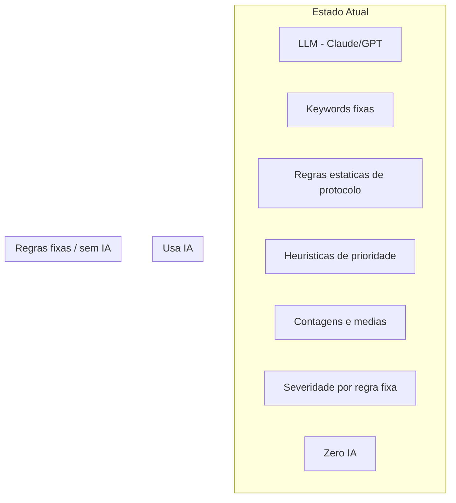
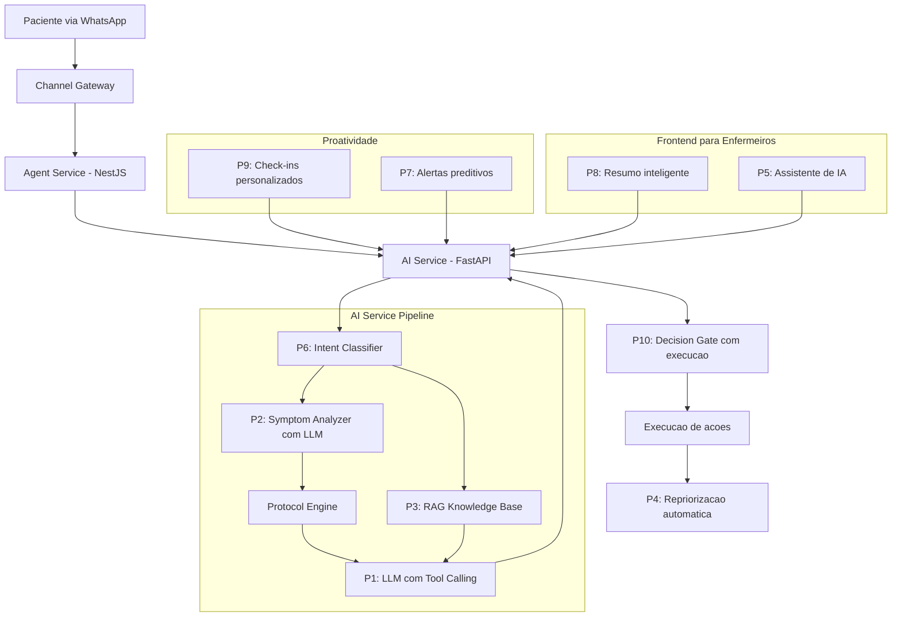

# Onde inserir IA no OncoNav para tornar o agente mais inteligente e autonomo

## Estado atual: o que e inteligente vs. o que e regra fixa

**Resumo**: O LLM so gera o texto da resposta ao paciente. Todo o resto (detectar sintomas, decidir acoes, priorizar, alertar, navegar, dashboard) e regra fixa.

---

## Os 10 pontos de insercao de IA

### PONTO 1 - LLM com Tool Calling para decidir acoes (AI Service)

**Onde**: [ai-service/src/agent/orchestrator.py](ai-service/src/agent/orchestrator.py) - metodo `process()`, substituir `llm_provider.generate()` por `llm_provider.generate_with_tools()`

**Hoje**: O LLM gera so texto. As acoes (registrar sintoma, criar alerta, iniciar questionario) sao decididas por `_compile_actions()` com regras fixas.

**Melhoria**: Dar ao LLM **tools** para ele decidir as acoes junto com a resposta:

- `registrar_sintoma(tipo, severidade, descricao)`
- `criar_alerta(severidade, motivo)`
- `iniciar_questionario(tipo)`
- `agendar_checkin(dias)`
- `escalar_para_enfermagem(motivo, urgencia)`
- `recomendar_consulta(especialidade, motivo)`

**Impacto**: O agente entende contexto e linguagem natural para decidir, em vez de depender de keywords. Ex.: "estou me sentindo pessimo, nao durmo ha 3 dias e minha boca esta cheia de feridas" -- hoje nao detecta nada (nao tem keyword); com tools, o LLM chama `registrar_sintoma("insonia", "high")` + `registrar_sintoma("mucosite", "high")` + `criar_alerta("HIGH", "mucosite + insonia persistente")`.

**Codigo existente que ja suporta**: `llm_provider.generate_with_tools()` ja esta implementado mas so e usado no symptom_analyzer (desligado).

---

### PONTO 2 - Analise de sintomas com LLM (AI Service)

**Onde**: [ai-service/src/agent/orchestrator.py](ai-service/src/agent/orchestrator.py) - linha `use_llm=False` no `symptom_analyzer.analyze()`

**Hoje**: `use_llm=False` sempre. So detecta sintomas por palavras-chave exatas.

**Melhoria**: Ligar `use_llm=True` sempre. O symptom_analyzer ja tem o fluxo LLM implementado em [ai-service/src/agent/symptom_analyzer.py](ai-service/src/agent/symptom_analyzer.py) (`_llm_analysis` com tools).

**Impacto**: Detecta sintomas em linguagem coloquial, giriass, contexto implicito. Ex.: "to com um gosto horrivel na boca e nao consigo comer nada" -> mucosite + anorexia.

---

### PONTO 3 - RAG com base de conhecimento (AI Service)

**Onde**: Novo modulo em `ai-service/src/agent/rag/` + alteracao em [ai-service/src/agent/context_builder.py](ai-service/src/agent/context_builder.py)

**Hoje**: O "RAG" e so formatacao de dados do paciente. Nao busca em nenhuma base de conhecimento. `sentence-transformers` esta no requirements.txt mas nunca e importado.

**Melhoria**: Criar base vetorial (FAISS ou ChromaDB local) com:

- FAQs por tipo de cancer e tratamento
- Orientacoes nutricionais, de exercicio, cuidados pos-quimio
- Protocolos resumidos em linguagem acessivel
- Informacoes sobre efeitos colaterais de medicamentos comuns

Antes de chamar o LLM, buscar os 3-5 trechos mais relevantes para a pergunta do paciente e incluir no prompt.

**Impacto**: Respostas fundamentadas em conteudo medico real. Ex.: "posso comer sushi durante a quimio?" -> recupera trecho sobre alimentacao segura + responde com base nele.

---

### PONTO 4 - Priorizacao automatica e preditiva (Backend + AI Service)

**Onde**:

- [backend/src/agent/agent.service.ts](backend/src/agent/agent.service.ts) - apos `executeDecision`, chamar endpoint `/prioritize`
- [backend/src/oncology-navigation/oncology-navigation.scheduler.ts](backend/src/oncology-navigation/oncology-navigation.scheduler.ts) - no cron diario, recalcular prioridades
- [ai-service/src/models/priority_model.py](ai-service/src/models/priority_model.py) - treinar o modelo ML

**Hoje**: O modelo de prioridade (RF + XGBoost + LGBM) nunca e treinado. O backend nunca chama `/prioritize`. A prioridade so muda manualmente.

**Melhoria**:

1. Treinar o modelo com dados sinteticos ou reais
2. Backend chama `/prioritize` automaticamente apos cada interacao do agente
3. Incluir novos sinais: scores ESAS, frequencia de sintomas, dias sem resposta, atrasos em etapas
4. Scheduler recalcula prioridade de todos os pacientes diariamente

**Impacto**: Enfermeiros veem automaticamente quem precisa de atencao. Prioridade muda em tempo real conforme o paciente reporta sintomas.

---

### PONTO 5 - Assistente de IA para enfermeiros (Frontend + Backend)

**Onde**:

- Novo endpoint no backend: `POST /api/v1/agent/nurse-assist`
- Frontend: [frontend/src/components/dashboard/conversation-view.tsx](frontend/src/components/dashboard/conversation-view.tsx)

**Hoje**: Enfermeiros leem conversas e decidem tudo manualmente. Nenhuma sugestao, nenhum resumo.

**Melhoria**: Quando o enfermeiro abre uma conversa:

1. **Resumo automatico**: "Paciente reportou dor 7/10 e nausea ha 3 dias. ESAS: fadiga alta. Etapa de biopsia atrasada 5 dias."
2. **Sugestoes de resposta**: 3 opcoes de texto para o enfermeiro clicar e enviar (ou editar)
3. **Sugestoes de acao**: "Considere: agendar consulta com nutricionista", "Considere: escalar para oncologista"

**Impacto**: Enfermeiro economiza 2-5 minutos por paciente. Decisoes mais rapidas e consistentes.

---

### PONTO 6 - Deteccao de intencao (intent) antes do LLM (AI Service)

**Onde**: Novo modulo `ai-service/src/agent/intent_classifier.py`, chamado no [orchestrator.py](ai-service/src/agent/orchestrator.py) antes do symptom_analyzer

**Hoje**: Toda mensagem vai pelo mesmo pipeline. "Oi bom dia" e "estou sangrando muito" recebem o mesmo tratamento.

**Melhoria**: Classificador rapido (modelo pequeno ou regras + LLM barato) que categoriza:

- `GREETING` -> resposta curta, sem acionar protocolo
- `SYMPTOM_REPORT` -> pipeline completo de sintomas + protocolo
- `QUESTION` -> buscar RAG + responder com base de conhecimento
- `EMOTIONAL_SUPPORT` -> tom mais empatico, oferecer apoio
- `APPOINTMENT_QUERY` -> info sobre proximos compromissos
- `EMERGENCY` -> escalacao imediata
- `OFF_TOPIC` -> redirecionar gentilmente

**Impacto**: Respostas mais adequadas ao contexto. Menos "ruido" no sistema de alertas. Escalacao instantanea para emergencias.

---

### PONTO 7 - Alertas preditivos (Backend + AI Service)

**Onde**:

- Novo endpoint: `POST /api/v1/agent/predict-risk`
- [backend/src/oncology-navigation/oncology-navigation.scheduler.ts](backend/src/oncology-navigation/oncology-navigation.scheduler.ts) - no cron diario

**Hoje**: Alertas so sao criados quando algo ja atrasou ou ja aconteceu.

**Melhoria**: Modelo que analisa historico do paciente e prediz:

- "Paciente X tem 80% de chance de atrasar a biopsia nos proximos 7 dias"
- "Paciente Y tem tendencia de piora nos scores ESAS (fadiga subindo 3 pontos/semana)"
- "Paciente Z nao responde ha 5 dias; historicamente pacientes com esse perfil abandonam tratamento"

**Impacto**: Enfermeiros agem ANTES do problema. Reducao de atrasos e abandono.

---

### PONTO 8 - Resumo inteligente do paciente (Backend + Frontend)

**Onde**:

- Novo endpoint: `POST /api/v1/agent/patient-summary`
- Frontend: [frontend/src/app/patients/[id]/page.tsx](frontend/src/app/patients/[id]/page.tsx)

**Hoje**: Enfermeiro precisa ler historico completo, etapas, alertas, questionarios para entender o caso.

**Melhoria**: LLM recebe contexto clinico completo e gera:

- Resumo de 3-5 linhas do estado atual
- Destaques (sintomas recorrentes, tendencias)
- Proximos passos recomendados
- Riscos identificados

**Impacto**: Enfermeiro entende o caso em 10 segundos em vez de 5 minutos.

---

### PONTO 9 - Check-ins e mensagens proativas personalizadas (AI Service + Backend)

**Onde**: [backend/src/agent/agent-scheduler.service.ts](backend/src/agent/agent-scheduler.service.ts) - metodo `executeAction()`

**Hoje**: Mensagens de check-in sao textos fixos genericos: "Ola! Como voce esta se sentindo hoje?"

**Melhoria**: Antes de enviar, chamar o AI Service com contexto do paciente para gerar mensagem personalizada:

- "Oi Maria! Faz 3 dias que voce fez a quimio. Como esta a nausea? Lembre-se de beber bastante agua."
- "Jose, sua biopsia esta agendada para amanha. Tem alguma duvida sobre o preparo?"

**Impacto**: Paciente sente cuidado individualizado. Taxa de resposta aumenta.

---

### PONTO 10 - Execucao de decisoes aprovadas (Backend - bug/gap)

**Onde**: [backend/src/agent/decision-gate.service.ts](backend/src/agent/decision-gate.service.ts) - metodo `approveDecision()`

**Hoje**: Quando o enfermeiro aprova uma decisao (ex.: CRITICAL_ESCALATION), o sistema so marca como "aprovada" no log. **Nao executa a acao.** Isso e um gap critico.

**Melhoria**: Implementar handler que, ao aprovar, executa a acao correspondente (criar alerta critico, notificar especialista, agendar consulta, etc.).

**Impacto**: Fecha o loop de autonomia. Sem isso, metade das decisoes do agente sao "desperdicio".

---

## Arquitetura proposta com IA em todo o sistema

---

## Fases de implementacao (sugestao)

### Fase 1 - Fundacao (semanas 1-3)

- **P10**: Corrigir execucao de decisoes aprovadas (bug critico, sem IA)
- **P2**: Ligar `use_llm=True` no symptom_analyzer (ja implementado, so ativar)
- **P1**: Substituir `generate` por `generate_with_tools` no orchestrator (tools ja existem no llm_provider)

### Fase 2 - Inteligencia do agente (semanas 4-7)

- **P6**: Intent classifier (modelo leve ou prompt de classificacao)
- **P3**: RAG com FAISS/ChromaDB + base de FAQs e orientacoes
- **P9**: Check-ins personalizados (chamar AI Service no scheduler)

### Fase 3 - Inteligencia operacional (semanas 8-11)

- **P4**: Priorizacao automatica (treinar modelo, integrar no backend)
- **P7**: Alertas preditivos (modelo de risco no scheduler diario)

### Fase 4 - Experiencia do enfermeiro (semanas 12-15)

- **P5**: Assistente de IA para enfermeiros (resumo + sugestoes)
- **P8**: Resumo inteligente do paciente na pagina de detalhes
