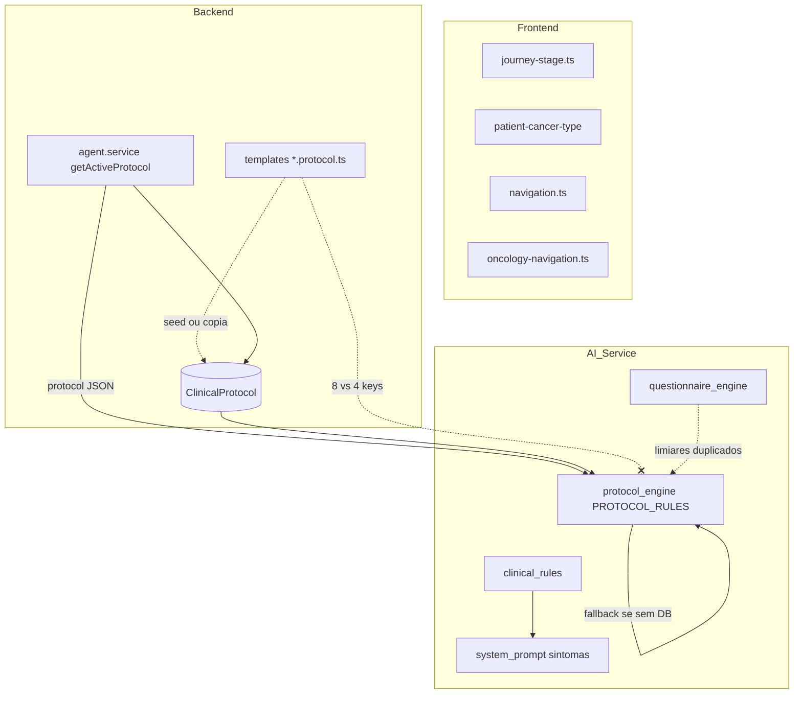

# Pesquisa em camadas e análise cruzada — paridade clínica ONCONAV

Documento complementar à [auditoria de paridade](clinical-parity-audit.md). Resume achados **separados** por **Frontend**, **Backend** e **ai-service**, depois **cruza** implicações e riscos.

### Domínio: cuidados paliativos (fase vs tipo de tumor)

- **Tipo de tumor / linha oncológica:** valor de `cancerType` no paciente ou diagnóstico (ex.: `breast`, `colorectal`) — não confundir com fase da jornada.
- **Fase da jornada:** enum `JourneyStage`, incluindo `PALLIATIVE` (“Cuidados Paliativos”) — ver `frontend/src/lib/utils/journey-stage.ts` e Prisma `JourneyStage`.
- **Status de cadastro:** `PatientStatus.PALLIATIVE_CARE` indica linha de cuidado paliativo; é **independente** do tipo de tumor. Na UI do hub de navegação, pacientes paliativos aparecem no **grupo do tipo de tumor** correspondente, com badge de linha paliativa — não existe “tipo de câncer paliativo” como chave de agrupamento.

---

## 1. Frontend — pesquisa detalhada

### 1.1 Jornada oncológica (`JourneyStage`)

- **Fonte central:** [`frontend/src/lib/utils/journey-stage.ts`](../../frontend/src/lib/utils/journey-stage.ts) — `JOURNEY_STAGES`, `JOURNEY_STAGE_LABELS`, `JOURNEY_STAGE_ORDER`, helpers `requiresOncologyCoreFields` / `requiresCurrentTreatmentField`.
- **Uso disperso:** dezenas de arquivos referenciam estágios (validações Zod em [`patient.ts`](../../frontend/src/lib/validations/patient.ts), abas de paciente, dashboard, [`oncology-navigation/page.tsx`](../../frontend/src/app/oncology-navigation/page.tsx)).
- **Inconsistência de tipagem:** [`oncology-navigation.ts`](../../frontend/src/lib/api/oncology-navigation.ts) — `getStepsByStage` e `initializeSteps` **omit** `PALLIATIVE` no union TypeScript, enquanto [`navigation.ts`](../../frontend/src/lib/api/navigation.ts) e o modelo de domínio incluem cinco estágios.
- **Duplicação de labels de tipo de câncer:** [`patient-cancer-type.ts`](../../frontend/src/lib/utils/patient-cancer-type.ts) define `CANCER_TYPE_LABELS` e `TREATMENT_OPTIONS_BY_CANCER_TYPE`. [`oncology-navigation/page.tsx`](../../frontend/src/app/oncology-navigation/page.tsx) e [`patient-navigation-tab.tsx`](../../frontend/src/components/patients/patient-navigation-tab.tsx) **remapeiam** para o formato `Câncer de ${v}` — duas convenções de exibição no mesmo produto.

### 1.2 Triagem / disposição clínica

- Tipo **`ClinicalDisposition`** em [`patients.ts`](../../frontend/src/lib/api/patients.ts) — espelha os cinco níveis usados no backend/IA.
- Uso explícito de strings em UI de observabilidade ([`observability/page.tsx`](../../frontend/src/app/observability/page.tsx)) — depende de alinhamento com o enum.

### 1.3 Clientes HTTP de navegação oncológica

- **Dois módulos:** [`navigation.ts`](../../frontend/src/lib/api/navigation.ts) (rotas estendidas, templates, `create-missing`) e [`oncology-navigation.ts`](../../frontend/src/lib/api/oncology-navigation.ts) (hooks em [`useOncologyNavigation.ts`](../../frontend/src/hooks/useOncologyNavigation.ts), upload com `axios` direto).
- **Mesmo prefixo** `/oncology-navigation/...` — risco de drift em **tipos de retorno** (ex.: `createMissingStepsForStage` com ou sem `message`).

### 1.4 Síntese frontend

| Domínio | Onde está | Risco principal |
|---------|-----------|-------------------|
| Estágios da jornada | `journey-stage.ts` + unions em APIs | `PALLIATIVE` ausente em partes da API client |
| Tipos de câncer / tratamento | `patient-cancer-type.ts` + overrides locais | Labels e opções de tratamento **não** derivados dos protocolos NestJS |
| Navegação | `navigationApi` vs `oncologyNavigationApi` | Duplicação de contratos e tipos |

---

## 2. Backend — pesquisa detalhada

### 2.1 Protocolos clínicos (templates + persistência)

- **Templates TypeScript:** [`backend/src/clinical-protocols/templates/`](../../backend/src/clinical-protocols/templates/) — `colorectal`, `bladder`, `renal`, `prostate`, `breast`, `lung`, `other` (8 tipos).
- **Registro:** [`clinical-protocols.service.ts`](../../backend/src/clinical-protocols/clinical-protocols.service.ts) — `PROTOCOL_TEMPLATES` com as 8 chaves.
- **Modelo Prisma** [`ClinicalProtocol`](../../backend/prisma/schema.prisma): `definition` (JSON), `checkInRules` (JSON), `criticalSymptoms` (JSON) **no nível raiz** do registro.

### 2.2 Agente NestJS → AI Service

- [`agent.service.ts`](../../backend/src/agent/agent.service.ts): `getActiveProtocol` lê **uma linha** `clinicalProtocol` ativa por `tenantId` + `cancerType`; o objeto é enviado no body para `POST /api/v1/agent/process` como `protocol`.
- **Não** envia diretamente os arquivos `.protocol.ts` — envia o que estiver **no banco** para aquele tenant.

### 2.3 Navegação oncológica

- [`oncology-navigation.service.ts`](../../backend/src/oncology-navigation/oncology-navigation.service.ts) — `JOURNEY_STAGE_ORDER` alinhado ao enum Prisma `JourneyStage` (cinco valores).
- Templates de etapas por tipo de câncer derivados dos protocolos / seeds (lógica extensa no service).

### 2.4 Tenant e escopo de tipos de câncer

- [`patients.service.ts`](../../backend/src/patients/patients.service.ts) / auth: `enabledCancerTypes` no tenant — MVP típico `['bladder']`.

### 2.5 Síntese backend

| Domínio | Onde está | Risco principal |
|---------|-----------|-------------------|
| Definição de protocolo | Templates TS + linhas `ClinicalProtocol` no DB | Seed/migração pode não refletir última versão do template |
| Sintomas críticos | `criticalSymptoms` em JSON no Prisma + listas nos templates | Formato **global** no template TS; conversão no ai-service espera sintomas **por estágio** dentro de `checkInRules` (ver cruzamento abaixo) |
| Tipos de câncer | 8 templates | Cobertura do agente Python embutido só 4 tipos se cair no fallback |

---

## 3. AI Service — pesquisa detalhada

### 3.1 Camadas de decisão

| Camada | Arquivo | Função |
|--------|---------|--------|
| Regras determinísticas | [`clinical_rules.py`](../../ai-service/src/agent/clinical_rules.py) | Disposição `REMOTE_NURSING` … `ER_IMMEDIATE`, limiares 38°C, SpO2 &lt; 92, dor ≥9, etc. |
| Protocolo / check-in / ESAS | [`protocol_engine.py`](../../ai-service/src/agent/protocol_engine.py) | `PROTOCOL_RULES` embutido; `ESAS_ALERT_THRESHOLD`, `PRO_CTCAE_ALERT_GRADE` (duplicados em `questionnaire_engine`) |
| Prompt de sintomas (LLM) | [`system_prompt.py`](../../ai-service/src/agent/prompts/system_prompt.py) | `_get_symptom_detection_rules` — faixas de dor e sinais em linguagem natural |
| Questionários | [`questionnaire_engine.py`](../../ai-service/src/agent/questionnaire_engine.py) | Mesmos limiares ESAS/PRO-CTCAE redefinidos localmente |
| Orquestração | [`orchestrator.py`](../../ai-service/src/agent/orchestrator.py) | Chama `clinical_rules_engine` antes do ML/LLM; depois `protocol_engine.evaluate(...)` com `cancer_type`, `journey_stage`, `protocol` do request |

### 3.2 `PROTOCOL_RULES` (fallback)

- Chaves presentes: **`colorectal`**, **`bladder`**, **`renal`**, **`prostate`** — **quatro** tipos.
- **Ausentes** em relação aos templates NestJS: **`breast`**, **`lung`**, **`other`**.

### 3.3 Integração com `protocol` do backend

- [`protocol_engine._get_rules`](../../ai-service/src/agent/protocol_engine.py): se `protocol` tiver `checkInRules`, usa [`_convert_db_protocol`](../../ai-service/src/agent/protocol_engine.py).
- `_convert_db_protocol` monta `critical_symptoms` **por estágio** apenas com `rules.get("criticalSymptoms", [])` **dentro** de cada entrada de `checkInRules`.
- No Prisma/template TS, **`criticalSymptoms` costuma estar no raiz do protocolo**, não dentro de cada estágio em `checkInRules`. Resultado provável: **listas vazias** por estágio na conversão, salvo se o JSON no banco duplicar sintomas dentro de cada fase.

### 3.4 Síntese ai-service

| Domínio | Onde está | Risco principal |
|---------|-----------|-------------------|
| Fallback por tipo | `PROTOCOL_RULES` | Tipos breast/lung/other sem regra embutida |
| Limiares ESAS | `protocol_engine` + `questionnaire_engine` | Duplicação literal de constantes |
| Prompt vs regras hard | `system_prompt` vs `clinical_rules` | Dor “8–10” no prompt vs dor **≥9** na regra R08 |
| Protocolo DB | `_convert_db_protocol` | Possível **não uso** de `criticalSymptoms` raiz do Prisma |

---

## 4. Cruzamento e análise

### 4.1 Fluxo de dados (visão integrada)

### 4.2 Matriz de cobertura por tipo de câncer

| Tipo | Template NestJS | `PROTOCOL_RULES` Python | Nota |
|------|-----------------|-------------------------|------|
| colorectal | Sim | Sim | Paridade possível no fallback |
| bladder | Sim | Sim | MVP típico |
| renal | Sim | Sim | |
| prostate | Sim | Sim | |
| breast | Sim | **Não** | Depende de protocolo no DB + `_convert_db_protocol` |
| lung | Sim | **Não** | Idem |
| other | Sim | **Não** | Idem |

### 4.3 Pontos de dessincronia crítica

1. **Sintomas críticos (Prisma vs conversão):** raiz `criticalSymptoms` pode não alimentar `protocol_engine` se `_convert_db_protocol` não mesclar com estágios — sintomas do **template/backend** podem não entrar na avaliação por estágio no Python.
2. **Dois clientes frontend** para as mesmas rotas aumentam chance de tipos divergentes (`PALLIATIVE`, payload de `create-missing`).
3. **Triagem:** decisão legal/clínica está em `clinical_rules.py`; o LLM segue `system_prompt.py` — divergência de limiares gera **texto ao paciente** inconsistente com o que o motor gravaria.
4. **Frontend `TREATMENT_OPTIONS_BY_CANCER_TYPE`:** catálogo de UX **independente** das etapas `TREATMENT` dos protocolos — esperado para formulários, mas não é “fonte única” com navegação clínica.

### 4.4 Prioridades sugeridas (alinhadas à auditoria)

1. **ai-service:** unificar constantes ESAS/PRO-CTCAE; alinhar texto de `_get_symptom_detection_rules` a `clinical_rules.py`; revisar `_convert_db_protocol` para incluir `criticalSymptoms` raiz do protocolo Prisma (ou documentar contrato explícito do JSON).
2. **Backend:** garantir que seed/API grave `checkInRules` compatível com o que `_convert_db_protocol` espera, **ou** ajustar o conversor para o formato real do `definition`/`criticalSymptoms`.
3. **Frontend:** corrigir unions com `PALLIATIVE`; consolidar ou documentar `navigationApi` vs `oncologyNavigationApi`.

---

## 5. Referências rápidas

- Auditoria original: [clinical-parity-audit.md](clinical-parity-audit.md)
- Plano P0 (constantes + prompt): ver plano ativo no repositório (paridade clínica P0)
